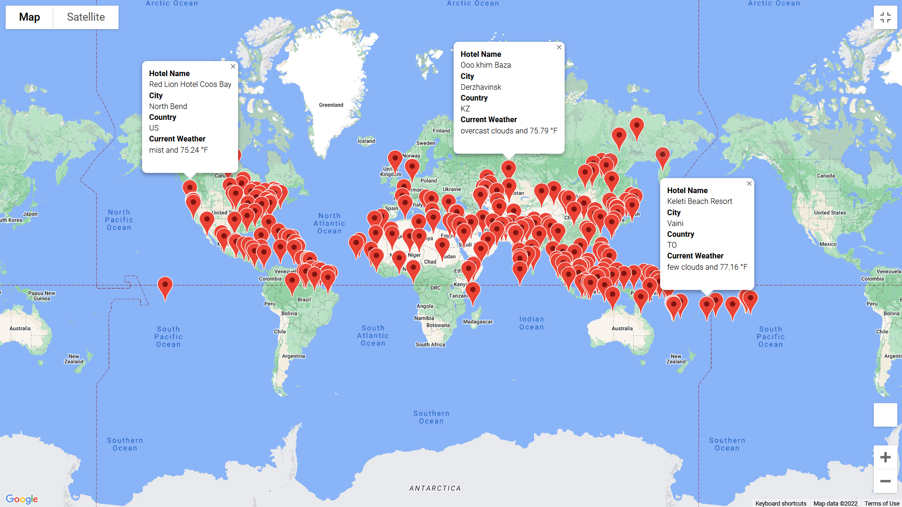
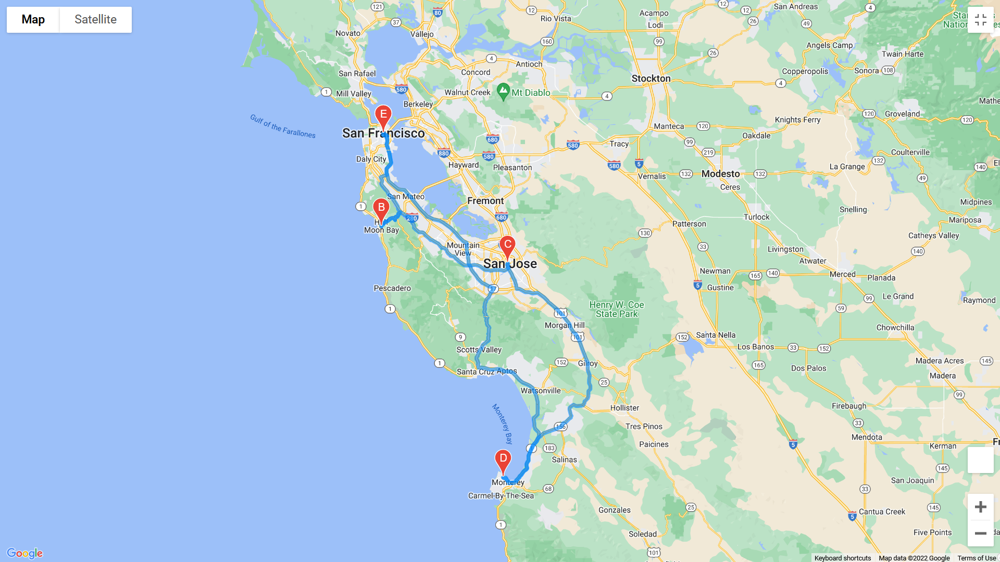

# Weather Analysis for Hotel Recommendation

## Overview
This project is the early version of a program to recommend hotels and travel locations to users based on their weather preferences.  Currently, we have randomly chosen over 500 cities from around the world, which we use OpenWeatherAPI to pull current weather data from.  Combining that data with Google Maps API, we can take a user's preferred customer range and use that to populate a map with hotels in areas that match.

## Vacation Search

[Vacation Search](Vacation_Search/Vacation_Search.ipynb) is where our recommendations are formed.  We create a map like the one above, showing one hotel per city where the user's temperature conditions are met.  When a marker is selected, a small textbox pops up to call out the city, country code, hotel name, and current weather.

## Vacation Itinerary

In the above example, we chose four cities matching our user's temperature criteria and used the Google Directions API to generate a route between them.  The markers here can be selected to show the same information as in the Vacation Search example.  

## Results
This is a promising start to a program, but in its current state it isn't the most useful.  A simple but time consuming improvement would be to list specific travel destinations rather than generating random coordinates.  Another addition we could make would be to account for more user weather preferences.  As is, our code stores data on humidity, cloudiness, and wind speed for each city, so it wouldn't be too difficult to update our selectors to include those as well.  
